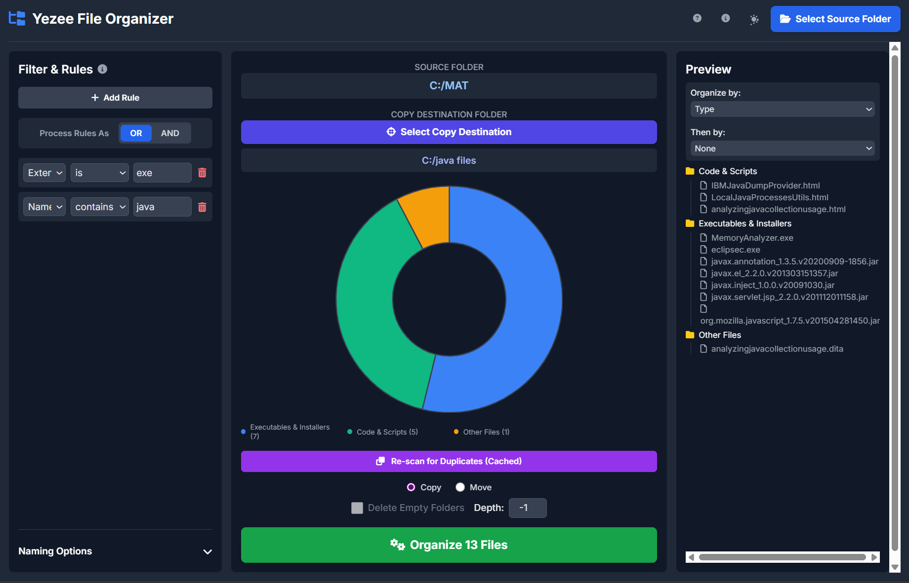

# Yezee File Organizer

**Version 1.5.1**  
*Created by Deepasri M Prasad*

A powerful and intuitive file organization tool that helps you automatically sort, filter, and manage your files with customizable rules and naming options.



## ✨ Features

- **Smart File Organization**: Organize files by type, date, size, or custom criteria
- **Duplicate Detection**: Find and manage duplicate files based on content
- **Flexible Filtering**: Create complex rules with wildcards and conditions
- **Custom Naming**: Add prefixes and suffixes to organized folders and files
- **Safe Operations**: Built-in undo functionality for move operations
- **Modern Interface**: Clean, responsive web-based UI with dark mode support


## 📋 Requirements

- **Python 3.6+**: Download from [python.org](https://python.org)
- **Web Browser**: Any modern browser (Chrome, Firefox, Safari, Edge)

## 🚀 Quick Start

### Development Mode

1. **Clone or Download** the project to your local machine

2. **Navigate to Project Directory**
   ```bash
   cd yezee-file-organizer
   ```

3. **Create Virtual Environment** (Recommended)
   ```bash
   python -m venv venv
   ```

4. **Activate Virtual Environment**
   ```bash
   # Windows
   venv\Scripts\activate
   
   # macOS/Linux
   source venv/bin/activate
   ```

5. **Install Dependencies**
   ```bash
   pip install -r requirements.txt
   ```

6. **Run the Application**
   ```bash
   python app.py
   ```

The application will automatically open in your default web browser at `http://127.0.0.1:5050`.

## 📖 How to Use

### 1. Select a Folder
Click the **Select Source Folder** button to choose the main directory you want to organize.

### 2. Configure Naming (Optional)
Use the **Naming Options** in the center panel to add a custom prefix or suffix to the generated folder and file names.

### 3. Find Duplicates (Optional)
Click **Find Duplicates** to scan files based on their content. This allows you to use the 'Duplicates' filter and organization criteria.

### 4. Create Rules (Optional)
Use the **Filter & Rules** panel to select which files to process. If no rules are added, all files will be included.

- **Add Rule**: Creates a new filter line
- **Process As**: Choose **OR** if any rule can match, or **AND** if all rules must match
- **Rule Properties**:
  - **Name/Extension**: Supports wildcards (`*` for many characters, `?` for one). Examples: `report*` or `jp?g`
  - **Size**: Use units like KB, MB, GB. Example: `> 10 MB`
  - **Date**: Filter by the file's last modified date

### 5. Choose How to Organize
Use the **Preview** panel to set up your new folder structure.

- **Organize by**: This is the main level of folders that will be created (e.g., folders for 'Images', 'Videos')
- **Then by**: This creates sub-folders within the main level (e.g., 'Images/2025-08')

### 6. Select an Operation
In the center panel, choose what to do with the filtered files:

- **Copy**: Copies files to a new location. You must select a separate **Copy Destination Folder**
- **Move**: Moves files within the source folder. This is faster but modifies the original directory
- **Delete Empty Folders**: When moving, this option (on by default) will clean up any folders that become empty after files are moved out of them

### 7. Organize!
Click the big green **Organize Files** button. After you confirm, a final summary report will be shown. This report includes an **Undo** button for move operations.

## 🔨 Building a Standalone Executable

Create a portable executable that can run on other computers without Python installed.

### Prerequisites
```bash
pip install pyinstaller
```

### Build Commands

**Windows:**
```bash
pyinstaller --onefile --windowed --add-data "index.html;." --add-data "script.js;." --add-data "style.css;." --add-data "content.json;." app.py
```

**macOS/Linux:**
```bash
pyinstaller --onefile --windowed --add-data "index.html:." --add-data "script.js:." --add-data "style.css:." --add-data "content.json:." app.py
```

> **Note**: The separator for `--add-data` is a semicolon (`;`) on Windows and a colon (`:`) on macOS/Linux.

### Find Your Executable
After the build process completes, find the `dist` folder in your project directory. Inside this folder is your standalone application (e.g., `app.exe` or `app`).

## 📁 Project Structure

```
yezee-file-organizer/
├── app.py              # Main Python application
├── requirements.txt    # Python dependencies
├── index.html         # Web interface
├── script.js          # Frontend JavaScript
├── style.css          # Application styling
├── content.json       # UI content and help text
├── images/
│   ├── image1.png     # Screenshot 1
│   └── image2.png     # Screenshot 2
└── README.md          # This file
```

## 🛠️ Dependencies

The application uses the following Python libraries (automatically installed with `pip install -r requirements.txt`):

- Flask (Web framework)
- Werkzeug (WSGI utilities)
- Additional dependencies as specified in `requirements.txt`

## 🔧 Troubleshooting

### Common Issues

**Application won't start:**
- Ensure Python 3.6+ is installed
- Verify all dependencies are installed: `pip install -r requirements.txt`
- Check if port 5050 is available

**Browser doesn't open automatically:**
- Manually navigate to `http://127.0.0.1:5050`
- Try a different browser
- Check firewall settings

**Build issues:**
- Ensure PyInstaller is installed: `pip install pyinstaller`
- Verify all files are in the correct directory
- Check file permissions

## 📝 License

This project is created by Deepasri M Prasad. Please respect the author's work and contributions.

## 🤝 Contributing

If you'd like to contribute to this project, please:

1. Fork the repository
2. Create a feature branch
3. Make your changes
4. Submit a pull request

## 📧 Support

For support, questions, or feedback, please contact the author or create an issue in the project repository.

---

**Yezee File Organizer v1.5.1** - Making file organization simple and efficient! 🗂️✨
